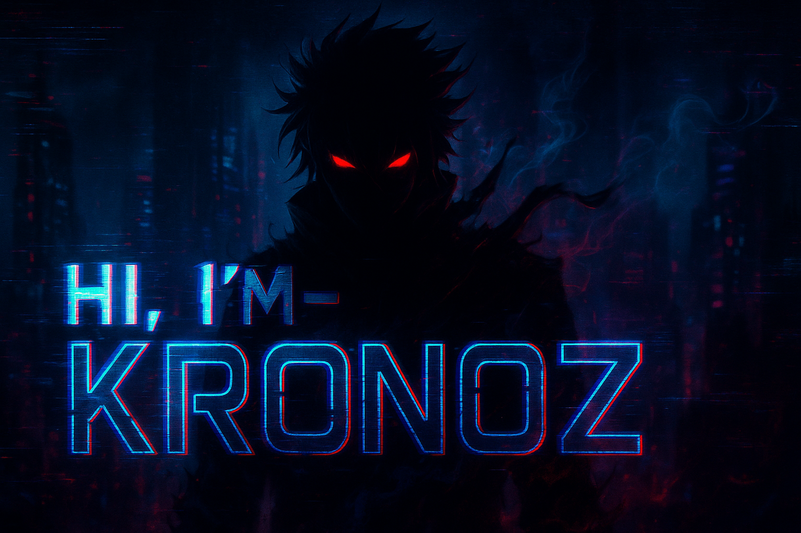

<small>I'm still learning about programming and cybersecurity</small>
<h1 align='center'>
   
  </a>
   
  𝕀𝕞-𝕂𝕣𝕠𝕟𝕠𝕫
   
</h1>
  <h3 align='center'>𝓘 𝓪𝓶 𝓬𝓾𝓻𝓻𝓮𝓷𝓽𝓵𝔂 𝓸𝓷 𝓽𝓱𝓮 𝓻𝓸𝓪𝓭 𝓽𝓸 𝓰𝓻𝓮𝓪𝓽𝓷𝓮𝓼𝓼. </h3>

  
<h4 align='center'>These little ones down here are the tools I'm studying. </h4>
 

<!---- Im Learning this programming tools ----->

  
  

  <a href="#">
    

  

 

<!---- Im Learning this programming tools ----->

<h3 align="left">My GitHub Stats:</h3>

    

 

  

<h3 align="left">Activity:</h3>

  
